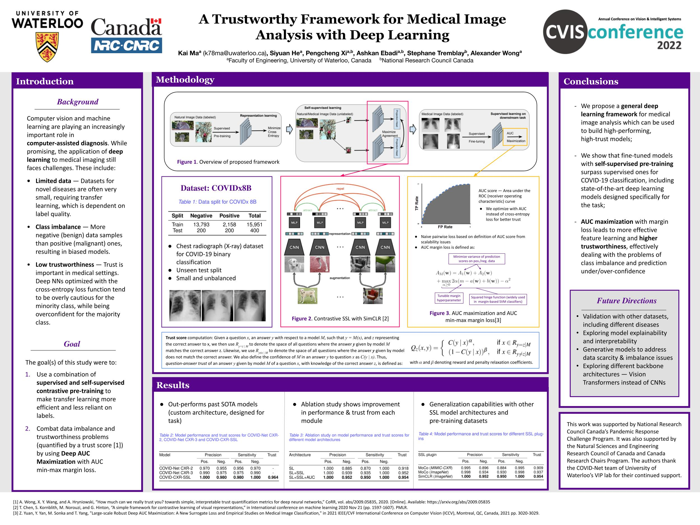

**Do not use this repository for self-diagnosis. You should check with your local authorities for the latest advice on seeking medical assistance.**

Paper: <https://arxiv.org/abs/2212.02764> <br><br>


# Training/Evaluation/Inference with COVIDNet-SSL

## Models
We include our flagship model, COVID-Net CXR-SSL, as well as second high-performing model, COVID-Net SSL-100.
|  Type | Input Resolution | COVID-19 Sensitivity |        Model        |
|:-----:|:----------------:|:--------------------:|:-------------------:|
|  ckpt |      224x224     |         98.0         |[COVID-Net CXR-SSL](https://drive.google.com/drive/folders/1iB1GA1q73usP5sLjkpb6t_WvGhP2_ZKm?usp=sharing)|
|  ckpt |      224x224     |         97.6         |[COVID-Net SSL-100](https://drive.google.com/drive/folders/1iB1GA1q73usP5sLjkpb6t_WvGhP2_ZKm?usp=sharing)|

## Introduction
Released COVIDNet-SSL models are based on ResNet-50 backbone with self-supervised pre-training on the SimCLR framework. Input shape is (3, 244, 244). Below are simple instructions for training, evaluation and validation using these models. 

## Requirements
- PyTorch 1.8.0
- Python 3.6
- Numpy
- Scikit-Learn
- Matplotlib
- TensorBoard Logger

For all requirements, see "requirements.txt".

### Directly installing conda environment
To install the conda enviroment on Windows, run
```
conda env create -f /path/to/win_env.yml 
```
To install the conda enviroment on Linux, run
```
conda env create -f /path/to/lin_env.yml
```
To activate the conda enviroment, run
```
conda activate covid-net
```
## Data Directory Structure
Instructions for creating the COVIDx9B dataset can be found at the [main COVID-Net repository.](https://github.com/lindawangg/COVID-Net)
For COVIDNet-SSL, the data directory is structured as such:
```
├── archive
│   ├── test
│   ├── test_8B.txt
│   ├── train
│   └── train_8B.txt
```
The "archive" folder is in the parent directory of the COVIDNet-SSL training, evaluation and inference scripts, such that it should be referred to as "../archive". This archive folder then contains "train" and "test" folders, which contain training and evaluation images respectively, as well as corresponding .txt files containing file names, classes and data sources. Please refer to the main COVID-Net repository linked above for more information on datasets.

## Steps for training
We provide you with the PyTorch training script, train.py. This script will train starting from a specified checkpoint; after training, it will save five checkpoints: best validation accuracy, best AUC, best F1, lowest validation loss, and last epoch. It will also create training logs and various diagrams such as validation loss curves and learning rate graphs.
To train:
1. Locate the checkpoint files (location of pretrained model)
2. For basic training from the COVIDNet-SSL pretrained model:
```
python train.py \
  --ckpt-path '/path/to/COVIDNet_SSL_50AUC.ckpt' \
  --data-dir '../archive' \
  --exp-dir './train_folder' \
  --optim 'SGD'
```
3. For more options and information:
```
python train.py --help
```

## Steps for evaluation
We provide you with the PyTorch evaluation script, eval.py. This script will evaluate a given checkpoint; it will calculate top-1 accuracy, ROC-AUC, trust score, as well as precision, recall and F1 for each class. 
To evaluate:
1. Locate the checkpoint files
2. To evaluate a checkpoint for COVIDNet-SSL:
```
python train.py \
  --ckpt-path '/path/to/COVIDNet_SSL_50AUC.ckpt' \
  --data-dir '../archive' \
  --exp-dir './train_folder'
```
3. For more options and information:
```
python eval.py --help
```

## Steps for inference
**DISCLAIMER: Do not use this prediction for self-diagnosis. You should check with your local authorities for the latest advice on seeking medical assistance.**
1. Download a model from the pre-trained models section
2. Locate model checkpoints and chest X-Ray image to be inferenced
3. To use inference script for COVIDNet-SSL:
```
python inferene.py \
  --ckpt-path '/path/to/COVIDNet_SSL_50AUC.ckpt' \
  --img-path '/path/to/image' \
  --exp-dir './inference_folder'
```
4. For more options and information:
```
python inference.py --help
```

